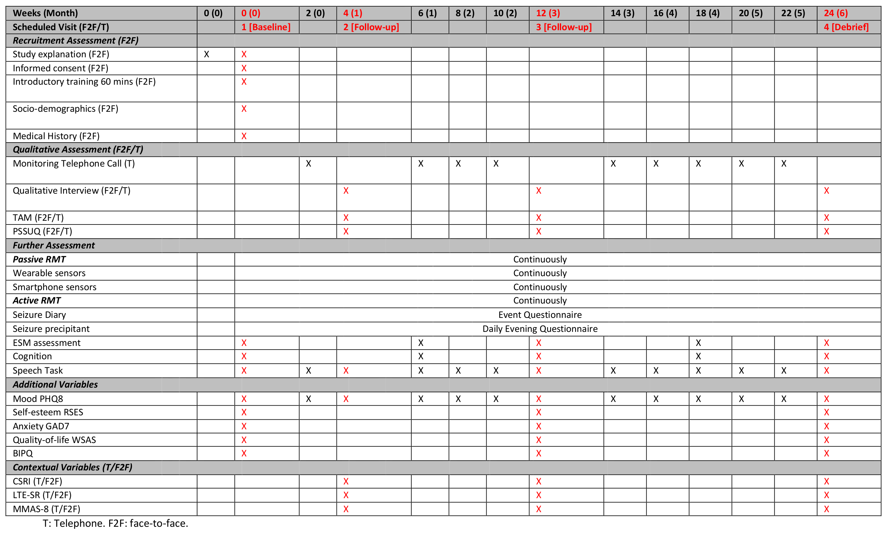

# RADAR-epilepsy-questionnaires

## Protocol

|                       | DEQ | PHQ8 | RSES | GAD7 | WSAS | BIPQ | ESM | Cognition | Speech |
|-----------------------|:---:|:----:|:----:|:----:|:----:|:----:|:---:|:---------:|:------:|
| repeat protocol       | 1d | 2w | 12w | 12w | 12w | 12w | 6w | 6w | 2w |
| time of day           | 19:00 | 9:30 | 9:30 | 9:30 | 9:30 | 9:30 | multi | 10:00 | 10:30 |
| reminders             | 1 | 3 | 3 | 3 | 3 | 3 | 0 | 3 | 3 |
| completion window     | 5h | 3d | 3d | 3d | 3d | 3d | 15min | 3d | 3d |
| est. completion (min) | 5 | 3 | 3 | 3 | 3 | 3 | 5 | 15 | 3 |
| in protocol           | ✔ | ✔ | ✔ | ✔ | ✔ | ✔ | ✔ | ✔ | ✔ |

There is also a demo version of the daily evening questionnaire (DEQ) that is activated at 9:00, has a completion window of 12h, and a repeat protocol of 5 years.

## Telephone/F2F Questionnaires
- TAM
- PSSUQ
- CSRI
- LTE-Q
- ~~MMAS-8~~

## Full Study Chart

## Notes
[Protocol & Schedule Doc](https://radar-base.atlassian.net/wiki/spaces/RAD/pages/463241217/Protocol+Schedule)

[Other Study Protocols](https://github.com/RADAR-base/RADAR-aRMT-protocols)

[Other Questionnaire Definitions](https://github.com/RADAR-base/RADAR-REDCap-aRMT-Definitions/tree/master/questionnaires)
